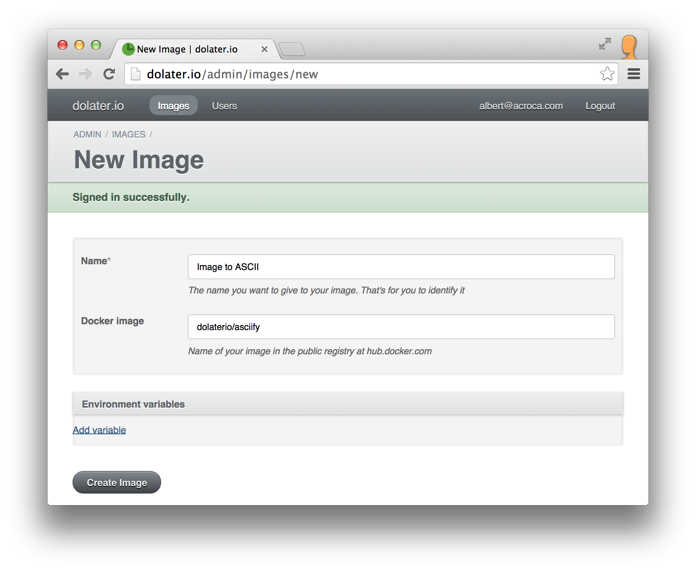
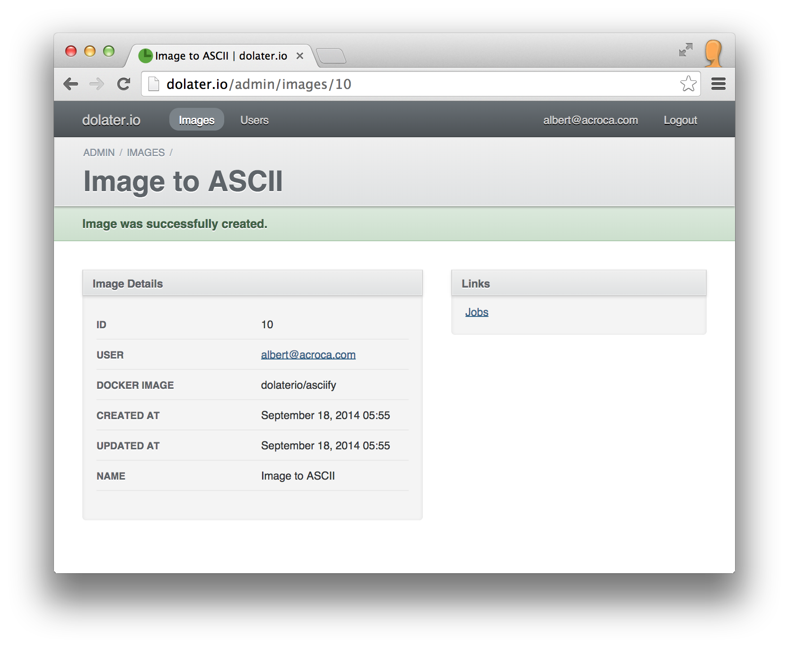
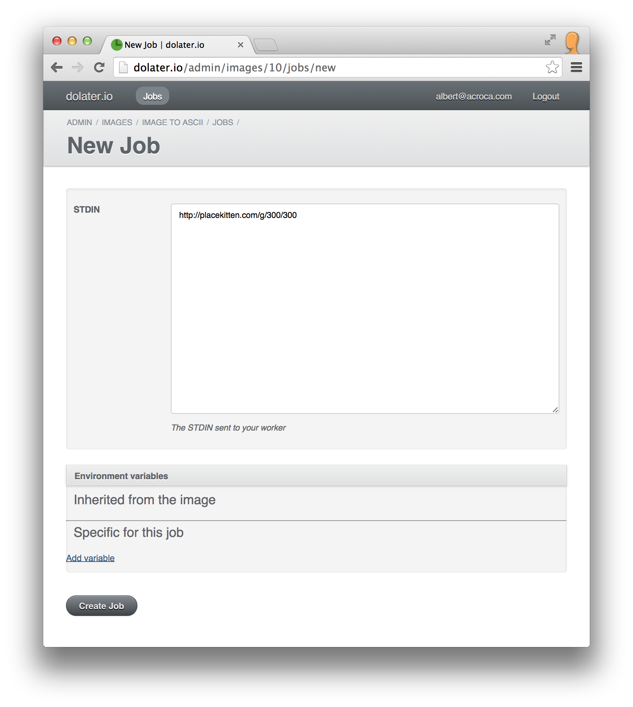
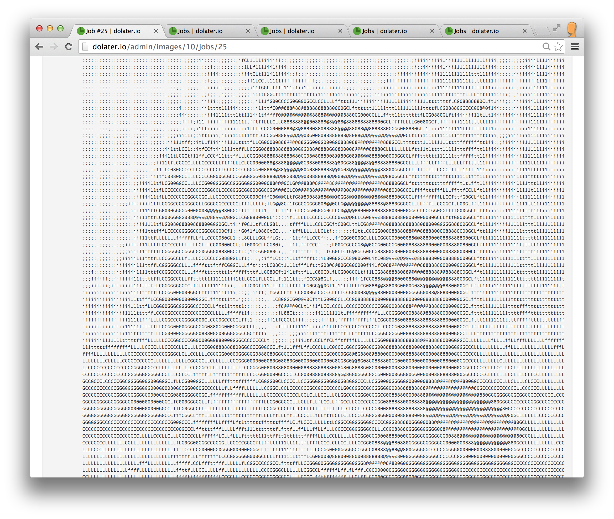

# ASCII image generator

This example will show you how to generate ASCII representation from existing pictures.

## 1. The docker image

To run anything in [dolater.io](http://dolater.io) you need to wrap your code in a docker image.

For this example we've created a [docker image that converts an image to ASCII](https://registry.hub.docker.com/u/dolaterio/asciify/) ([source](https://github.com/dolaterio/asciify)) identified as `dolaterio/asciify`.

## 2. Create a dolater.io image

Access to your admin interface at [http://dolater.io/admin](http://dolater.io/admin) and click on _New Image_.

In the new image form type any name for your image. In the _docker image_ field type `dolaterio/asciify` to use our docker image to convert images to ASCII.



For this example we don't need to set any environment variables, so proceed and save the image.

## 3. Create jobs for the image


There are two ways to create jobs, using the web interface or sending an HTTP request to our API.

### 3.1. Create the job using the web interface

Once the image is created you'll see the following view



Click on _Jobs_ to access the list of jobs for this image. It's empty for now. Click on _New job_.

Our asciify app takes the image URL from the _STDIN_, so just paste any image URL to the _STDIN_ field. If you don't have any image url in mind, you can use `http://placekitten.com/g/300/300` like in the example.



Click on `Create job` and our servers will pick your job and run it.

### 3.2. Create the job using the API

To use the API you'll need to pass your e-mail and authentication token in the request. You can find it in your profile clicking on your e-mail address in the header of the admin panel.

Once you have your e-mail and authentication token, you'll have to send the http request to create a new job of your image.

```
curl \
-X POST \
-H "Content-Type: application/json" \
-H "X-User-Token: TOKEN" \
-H "X-User-Email: EMAIL" \
-d '{"job": {"payload": "http://placekitten.com/g/300/300"}}' \
"http://dolater.io/admin/images/IMAGE_ID/jobs.json"
```

Replace `TOKEN`, `EMAIL` and `IMAGE_ID` with the right values. You can also try with a different image url.

### 4. Check the job results

Our asciify image prints out the ascii image to the STDOUT. Open the list of jobs of your image and you'll see the image there. If you don't, enable the _completed_ filter to see the completed jobs.

Click on _View_ of your job to see its details. Eventually you should see your image in ASCII.


