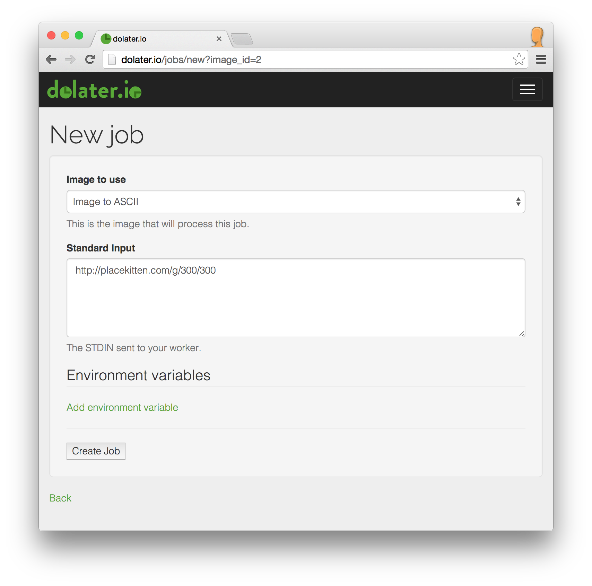

# ASCII image generator

This example will show you how to generate ASCII representation from existing pictures.

## 1. The docker image

To run anything in [dolater.io](http://dolater.io) you need to wrap your code in a docker image.

For this example we've created a [docker image that converts an image to ASCII](https://registry.hub.docker.com/u/dolaterio/asciify/) ([source](https://github.com/dolaterio/asciify)) identified as `dolaterio/asciify`.

## 2. Create a dolater.io image

Access [your images on dolater.io](http://dolater.io/images) and click on _New image_.

In the new image form type any name for your image. In the _docker image_ field type `dolaterio/asciify` to use our docker image to convert images to ASCII.

For this example we don't need to set any environment variables, so proceed and save the image.

## 3. Create jobs for the image

Access [your jobs on dolater.io](http://dolater.io/jobs) and click on _New job_.

Select the asciify image you created on the previous step. Our asciify app takes the image URL from the _STDIN_, so just paste any image URL to the _STDIN_ field. If you don't have any image url in mind, you can use `http://placekitten.com/g/300/300` like in the example.

Click on `Create job` and our servers will pick your job and run it.

### 4. Check the job results

Our asciify image prints out the ascii image to the STDOUT. Open the list of jobs of your image and you'll see the image there. If you don't, enable the _completed_ filter to see the completed jobs.

Click on _View_ of your job to see its details. Eventually you should see your image in ASCII.

