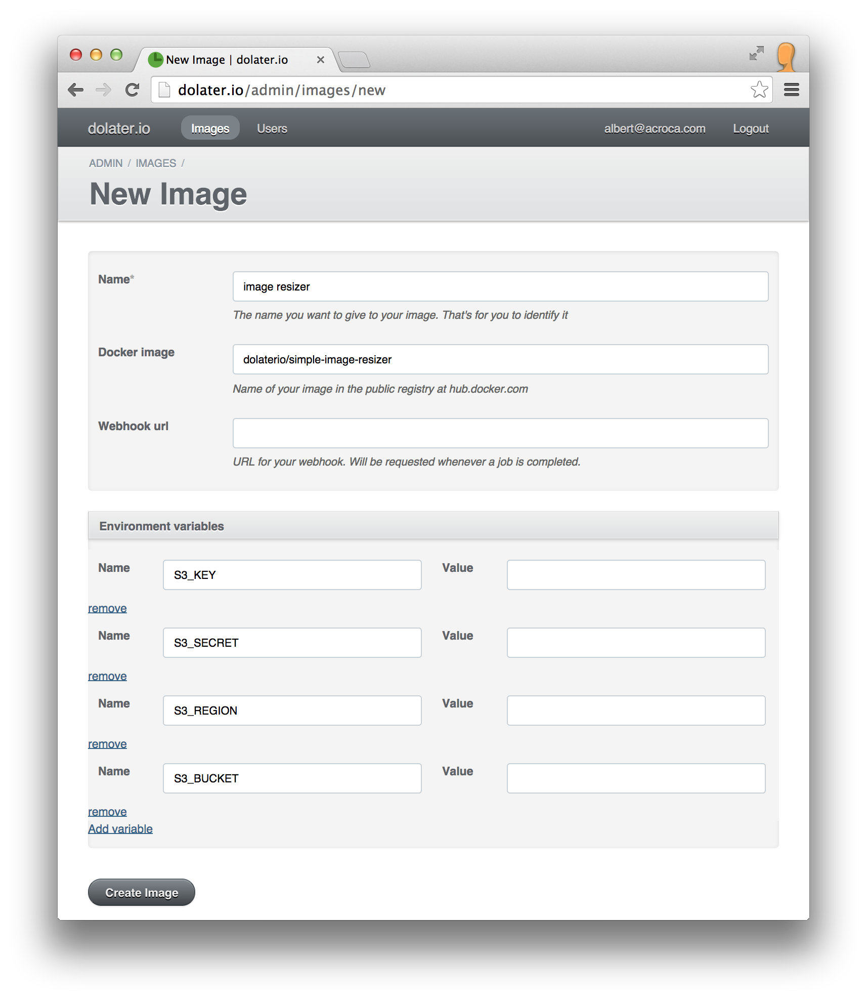

# Image resizer to S3

This example will show you how to resize online images and store them to your own S3 bucket.

## 1. The docker image

For this example we've created a [docker image that resizes an image and uploads it to S3](https://registry.hub.docker.com/u/dolaterio/simple-image-resizer/) ([source](https://github.com/dolaterio/simple_image_resizer)) identified as `dolaterio/simple-image-resizer`.

## 2. Create a dolater.io image

Access to your admin interface at [http://dolater.io/admin](http://dolater.io/admin) and click on _New Image_.

In the new image form type any name for your image. In the _docker image_ field type `dolaterio/simple-image-resizer` to use our docker image that resizes an image and uploads it to S3.

You'll need to add the environment variables `S3_KEY` `S3_SECRET` `S3_REGION` `S3_BUCKET` with your S3 credentials.



(In the _Value_ you'll have to set a value.)

## 3. Create jobs for the image


Access [your jobs on dolater.io](http://dolater.io/jobs) and click on _New job_.

Our image resizer needs a json object in the STDIN with the job information. Type the following:

```
{
    "width":30,
    "height":50,
    "url":"http://upload.wikimedia.org/wikipedia/commons/2/22/Turkish_Van_Cat.jpg",
    "destination":"test.jpg"
}
```

You can also try with a different image url. Check the main documentation of the [Simple Image Resizer](https://github.com/dolaterio/simple_image_resizer) for more information about the payload.

### 4. Check the job results

Once the job is submitted, you can track its status on the admin interface. Once the job is _completed_ without errors, check your S3 bucket and you'll see the resized image.
