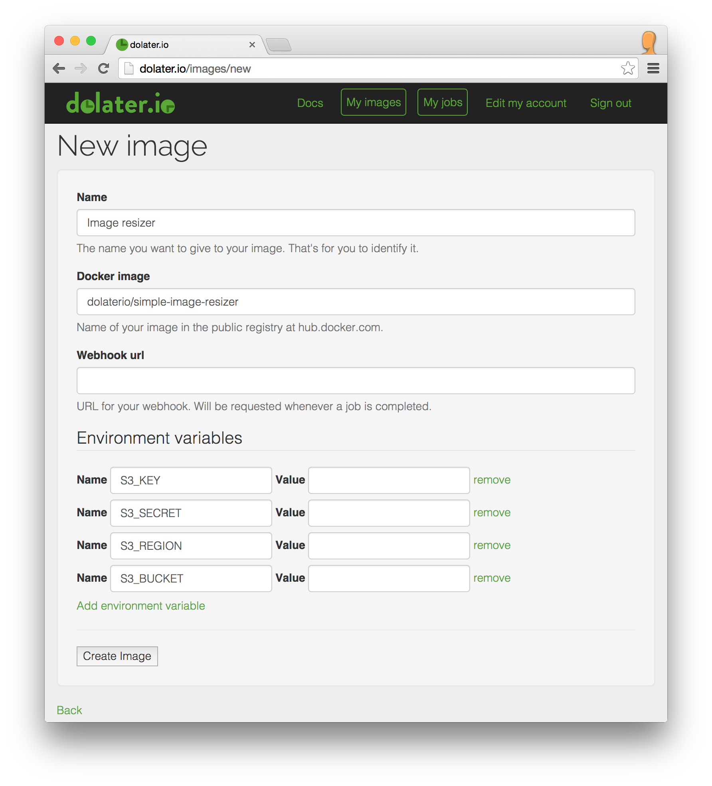

# Image resizer to S3

This example will show you how to resize online images and store them to your own S3 bucket.

## 1. The docker image

For this example we've created a [docker image that resizes an image and uploads it to S3](https://registry.hub.docker.com/u/dolaterio/simple-image-resizer/) ([source](https://github.com/dolaterio/simple_image_resizer)) identified as `dolaterio/simple-image-resizer`.

## 2. Create a dolater.io image

Access to your admin interface at [http://dolater.io/admin](http://dolater.io/admin) and click on _New Image_.

In the new image form type any name for your image. In the _docker image_ field type `dolaterio/simple-image-resizer` to use our docker image that resizes an image and uploads it to S3.

You'll need to add the environment variables `S3_KEY` `S3_SECRET` `S3_REGION` `S3_BUCKET` with your S3 credentials.



(In the _Value_ you'll have to set a value.)

## 3. Create jobs for the image

There are two ways to create jobs, using the web interface or sending an HTTP request to our API.

In prevous examples we've covered the creation using both ways, here we'll just use the API.

To use the API you'll need to pass your e-mail and authentication token in the request. You can find it in your profile clicking on your e-mail address in the header of the admin panel.

Once you have your e-mail and authentication token, you'll have to send the http request to create a new job of your image.

```
curl \
-X POST \
-H "Content-Type: application/json" \
-H "X-User-Token: TOKEN" \
-H "X-User-Email: EMAIL" \
-d '{"job": {"payload": "{ \
    \\"width\\":30, \
    \\"height\\":50, \
    \\"url\\":\\"http://upload.wikimedia.org/wikipedia/commons/2/22/Turkish_Van_Cat.jpg\\", \
    \\"destination\\":\\"test.jpg\\" \
    }"}}' \
"http://dolater.io/admin/images/IMAGE_ID/jobs.json"
```

Replace `TOKEN`, `EMAIL` and `IMAGE_ID` with the right values. You can also try with a different image url. Also you might want to change the json payload to something else, check the main documentation of the [Simple Image Resizer](https://github.com/dolaterio/simple_image_resizer) for more information about the payload.

### 4. Check the job results

Once the job is submitted, you can track its status on the admin interface. Once the job is _completed_ without errors, check your S3 bucket and you'll see the resized image.
